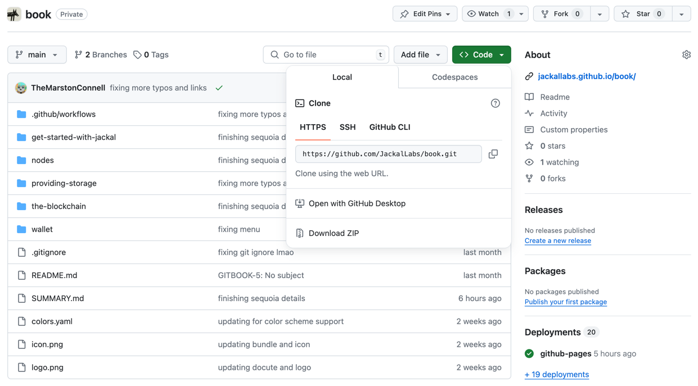

# Introduction

## Welcome to the Jackal Docs

Welcome, to the Jackal Documentation, where you'll embark on a journey to discover a more secure, simple, and self-custodial digital world. It doesn't matter if you are here to learn more about the protocol, develop novel applications using Jackal storage or are just poking around, you're sure to find exactly what you need.

### Contributing

In order to keep these docs up to date, they are open-source and hosted on GitHub. This means that if you find information that is out of date, or lacking in substance, you can submit edits of your own.


All edits undergo a review process by the Jackal Labs team before being reflected here.


Start by cloning the Jackal Book GitHub repo.
```shell
git clone https://github.com/JackalLabs/book.git
```



From there, you can edit any of the `.md` files, and add new ones to edit/create pages in the book.

To test your edits, download [Docute!](https://github.com/TheMarstonConnell/docute). You can install it by running:
```shell
go install github.com/TheMarstonConnell/docute@latest
```

From here, you can test your changes by running the following commands and going to [localhost:9797](http://localhost:9797).

```shell
cd book
docute generate
docute host
```

If you want more information about Docute, the documentation engine this site uses, check out the [Docute docs](https://jackallabs.github.io/docute/).

#### Side Bar

`SUMMARY.md` is a markdown representation of the side navigation bar which is compiled onto every page. Making changes here will change how you navigate through the book itself. Remember, any time you add a page, it is a good idea to add it to the sidebar to make it accessible unless you specifically want to nest it within other pages. 
